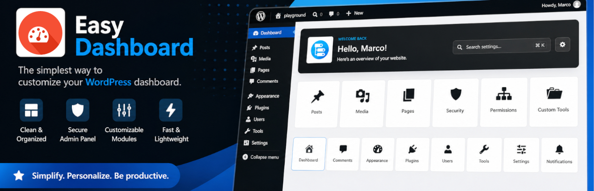
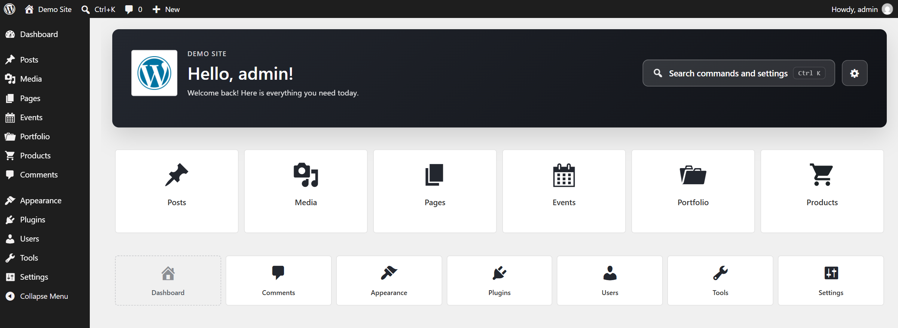

# Easy Dashboard – Clean Admin Welcome Screen

A cleaner start for WordPress admin. Replace the default dashboard with a welcome page made of large tiles, a branded header and faster access to your content.

[](https://wordpress.org/plugins/easy-dashboard/)
[](https://wordpress.org/plugins/easy-dashboard/)
[](https://wordpress.org/plugins/easy-dashboard/)
[](https://wordpress.org/plugins/easy-dashboard/)
[](https://wordpress.org/plugins/easy-dashboard/#reviews)
[](https://www.gnu.org/licenses/gpl-2.0.html)



Easy Dashboard is made for sites where the admin is used by people who are not WordPress experts: clients, editors and content teams.

The default dashboard is full of widgets that most users never read, and the content they actually work on is one menu away. Easy Dashboard replaces it with a single, focused screen: every section the user can reach, as a large tile, with shortcuts to create new content.

**Made for** agencies handing sites over to clients, editorial teams, public administrations and schools, and any site with custom post types.



## Features

### A focused welcome page

- Replaces the default **Dashboard** screen with a custom welcome page
- Branded header with site logo, personalized greeting and optional tagline
- Button to open the WordPress command palette (WordPress 6.9+)
- Pending updates notice for WordPress, plugins and themes, for administrators only

### Tiles for every section

- Large tiles for posts, pages, media and **custom post types**, detected automatically
- Smaller tiles for every other admin section, including the ones added by plugins
- Quick action on content tiles to create a new item
- Tiles follow the current user's capabilities, and reuse the translated WordPress menu labels and icons
- One tile always leads back to the classic dashboard and its widgets

### Customize the look

- Admin-only settings panel, inline on the welcome page
- Preset color schemes, or a custom two-color gradient
- Live preview while choosing the colors

## Requirements

- WordPress 6.0+
- PHP 7.4+

## Installation

From the WordPress dashboard: **Plugins → Add New → search for "Easy Dashboard"**.

After activation, open the admin: the Dashboard screen redirects to Easy Dashboard. Administrators can set the tagline and colors from the gear icon in the header.

## For developers

| Hook | Type | Description |
| --- | --- | --- |
| `easy_dashboard_should_redirect` | Filter | Whether the default dashboard redirects to Easy Dashboard. Default `true` |

```php
// Keep the classic dashboard for administrators
add_filter('easy_dashboard_should_redirect', function ($should_redirect) {
    return !current_user_can('manage_options');
});
```

The classic dashboard is always reachable at `wp-admin/index.php?ed_classic=1`.

## Contributing

Issues and pull requests are welcome.

## Links

- [Plugin page on WordPress.org](https://wordpress.org/plugins/easy-dashboard/)
- [Support forum](https://wordpress.org/support/plugin/easy-dashboard/)
- [Changelog](readme.txt)

## Credits

Copyright © 2015-2026 **Marco Milesi**
[www.marcomilesi.com](https://www.marcomilesi.com)
